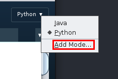
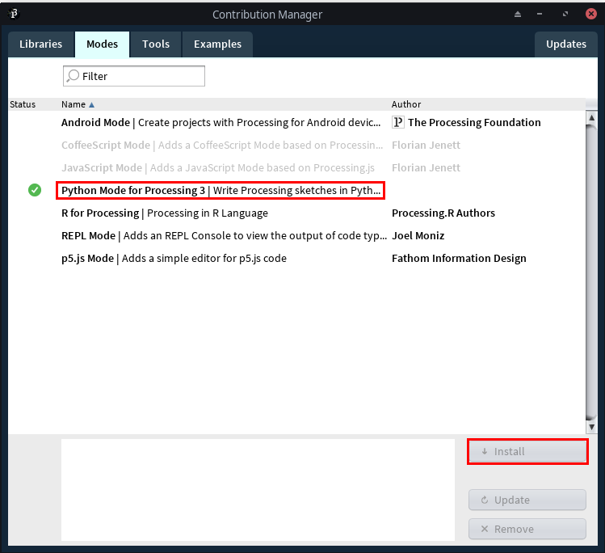

# MFBA
## Magnet Faculty Battle Arena

MFBA is a MOBA-style game written in [Processing.py](https://py.processing.org), with characters you know and love from Magnet High School, like Mr. Sanservino.

Presentation is found [here](https://docs.google.com/presentation/d/1IYn48w6rhyWR2i4wQwp98KQwt2uIdncMYtXzNo8GIo4/edit?usp=sharing).

## Features

### Object-Oriented Programming
This project makes heavy use of OOP. We can use the example of Attackables. Anything attackable is in the class attackable, and each type of attackable inherits from attackable in the following fasion:

* `Attackable`
    * `Mob`
        * `Player`
        * `Creep`
    * `Structure`
        * `Tower`
        * `Nexus`

This allows for most functions that all attackables do (like attacking, debuff processing, etc.) to be inherited to all classes. Similarly, almost everything inherits from the `Entity` class. That way, movement, collisions, etc. on all objects at once.

We also created classes for "trackers" (like PlayerTracker, StructureStracker, etc.) that are called in the main driver code. Each one of these has a list of all elements it tracks, and processes the relevant functions for those elements every game tick.

### Networking
Processing's [network library](https://www.processing.org/reference/libraries/net/) also works for Processing.py. This allows for us to implement multiplayer. A single server instance to be running, and processing all game actions, while client code renders and displays the game to the players. Server does all computations in order to prevent cheating by tampering with packets.

### Pathfinding
adam you do dis

## Play this Game

### 1. Download relevant software 
#### a. Download [processing](https://processing.org)

#### b. Install Python Mode
* In the top right corner, select "Java", then add Mode:

* select Python Mode, then click "Install":

#### c. Clone our repository
`git clone https://github.com/Azamlynny/MFBA.git'

### 2. Start Server

#### a. Open Server Code in Processing IDE
Server code found at [/src/Server/Driver](/src/Server/Driver)
#### b. Run Server Code
Look for the play button in the top right corner of Processing IDE
#### c. Note down Server IP
The IP is printed in the IDE console, but may indicate a loopback address. in this case, open your command prompt
##### i. Find IP in Windows with cmd
run `ipconfig`, and find your local IP:

##### ii. Find IP in Linux (Bash)
run `ifconfig` and find your local IP:

##### iii. Find IP in MacOS
run `ifconfig` and find your local IP:

#### iv. Find IP in Powershell
run `Get-NetIPAddress | Format-Table`:

Keep in mind that your local IP will look like one of the following:

### Start Client(s)

#### a. Open Client Code in Processing IDE
* Client code found at [/src/Client/Driver](/src/Client/Driver)
##### b. Run Client Code
* Running Client Code is the same as Server code. Just remember to replace the `ip` variable in Driver.pyde with the server's ip address.

### Controls
* Mouse
    * __Right Click__ will move your character. If you right click an Attackable (Player, Creep, Tower), your player will pathfind to attack it.
    * __Left Click__ will use a special ability if selected. Otherwise, if you click an Attackable, you can see its GUI.
    * __Middle Click__ pans the camera.
* Keyboard
    * __Q__ will select special ability 1
    * __E__ will select special ability 2
    * __W,A,S,D__ will pan the camera.
    * __Space__ will lock the camera on your player
    * __Grave/Tilde (`/~)__ will deselect abilities
* Developer Mode (Server only)
    * Tree editing
        * __J, K, L (simultaneously)__ will toggle tree editing mode.
        * __Left Click__ will place trees
        * __T__ will delete the last tree placed
        * __O__ will write your current tree configuration to a txt file.
    * Pathfinding Node editing
        * ___H, J, K (simultaneously)__ will toggle node editing mode.
        * __Left Click__ will place nodes
        * __P__ will save your current node configuration to a txt file.